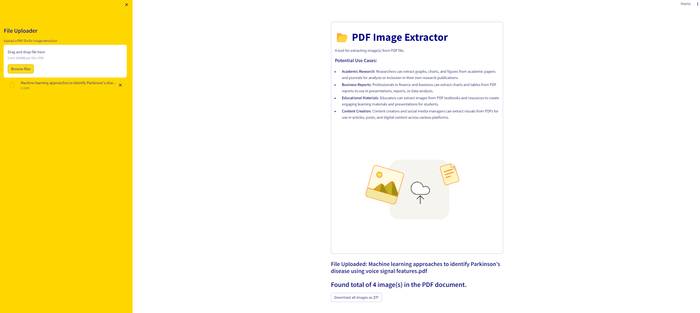

## PDF Image Extractor

### Background

#### Potential Use Cases
- Academic Research: Researchers can extract graphs, charts, and figures from academic papers and journals for analysis or inclusion in their own research publications.
- Business Reports: Professionals in finance and business can extract charts and tables from PDF reports to use in presentations, reports, or data analysis.
- Educational Materials: Educators can extract images from PDF textbooks and resources to create engaging learning materials and presentations for students.
- Content Creation: Content creators and social media managers can extract visuals from PDFs for use in articles, posts, and digital content across various platforms.

⏩ <a href =" ">Web Application</a>
